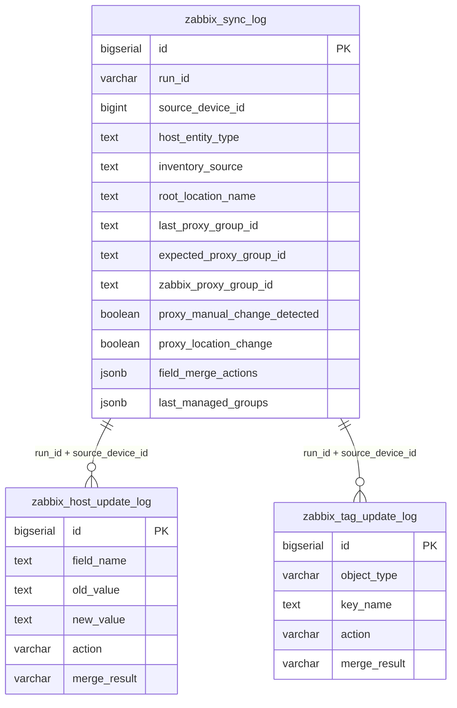

# HMDL Zabbix-Netbox audit tables (`hmdl` schema)

Canonical DDL for the three logging tables used by `netbox_zabbix_sync` Ansible role.

## Table roles

| Table | Granularity | Purpose |
|-------|-------------|---------|
| `zabbix_sync_log` | One row per host per sync run | Run summary: operation, status, inventory context, proxy/merge decisions |
| `zabbix_host_update_log` | One row per changed host field | Host-level diffs (IP, proxy_group, visible_name, host_groups, …) |
| `zabbix_tag_update_log` | One row per changed tag/macro | Tag and macro-level diffs (`object_type`: tag, macro) |

## Entity model

## Smart merge columns (`zabbix_sync_log`)

Used by proxy-group logic in `hmdl_read_last_sync.yml` and `zabbix_host_operations.yml`:

| Column | Usage |
|--------|--------|
| `root_location_name` / `last_location` | DC root; location-change detection |
| `expected_proxy_group_id` | Calculated from `DC_ID` + datacenter mapping |
| `last_proxy_group_id` | Proxy group written or intended by automation |
| `zabbix_proxy_group_id` | Proxy group on Zabbix at sync time |
| `proxy_location_change` | `true` when location changed and proxy was updated |
| `proxy_manual_change_detected` | `true` when Zabbix proxy differs from log but location unchanged |
| `field_merge_actions` | JSON map, e.g. `{"tags":"updated","visible_name":"preserved_manual"}` |
| `last_visible_name` | Visible name applied or preserved |
| `last_managed_groups` | JSON array of automation-managed group names |

## Inventory routing columns

| Column | Values |
|--------|--------|
| `host_entity_type` | `device`, `platform`, `virtual_fw` |
| `inventory_source` | `loki`, `datalake` |
| `source_table` | Discovery table name when `datalake` |

## Applying to an existing database

1. Run [`migrations/001_smart_merge_audit_columns.sql`](migrations/001_smart_merge_audit_columns.sql) on production/staging.
2. New environments: run the three `*.sql` files in order (sync_log → host_update_log → tag_update_log).

Playbooks also run `CREATE TABLE IF NOT EXISTS` and `ADD COLUMN IF NOT EXISTS` at runtime when `hmdl_log_enabled: true`.
