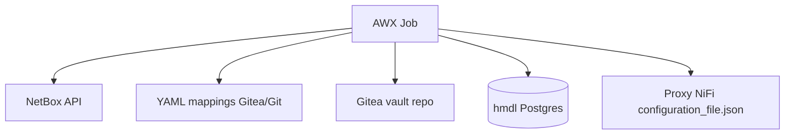

# Architecture — datalake-collectors

## Components

- **datalake-collectors** Ansible role — orchestration
- **collector_core.py** — mapping and reconcile logic
- **HMDL tables** — inventory and audit
- **NiFi** — consumes unchanged JSON key names and comma-separated IP strings
