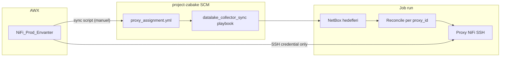

# AWX Kullanım Rehberi — Datalake Collector Sync (HMDL)

Bu rehber, **`datalake_collector_sync`** rolünü AWX üzerinde çalıştırmak için gerekli Job Template ayarlarını, envanter–proxy eşlemesini, Extra Variables / Survey alanlarını ve operasyon akışını açıklar.

| Konu | Doküman |
|------|---------|
| İngilizce özet | [AWX_GUIDE.md](AWX_GUIDE.md) |
| Multi-DC rollout checklist | [AWX_ROLLOUT_CHECKLIST.md](AWX_ROLLOUT_CHECKLIST.md) |
| DC bazlı rollout | [DC_ROLLOUT_GUIDE.md](DC_ROLLOUT_GUIDE.md) |
| Playbook | [`playbooks/datalake_collector_sync.yaml`](../../playbooks/datalake_collector_sync.yaml) |
| Varsayılanlar | [`defaults/main.yml`](../../playbooks/roles/datalake_collector_sync/defaults/main.yml) |

---

## 1. AWX envanteri vs `proxy_assignment.yml`

**Kısa cevap:** AWX envanterine yeni proxy eklemek tek başına otomasyonu etkilemez. Playbook hedefleri **`mappings/proxy_assignment.yml`** dosyasından okur.



| Katman | Rol |
|--------|-----|
| **AWX `NiFi_Prod_Envanter`** | NiFi hostları için SSH erişimi (Machine Credential). Playbook `hosts: localhost` ile çalışır; reconcile task'ları `delegate_to` ile envanterdeki IP'lere gider. |
| **`proxy_assignment.yml`** | Hangi `proxy_id` → hangi IP, `conf_path`, Gitea audit yolu. NetBox DC kodu → tüm NiFi node'ları eşlemesi buradan gelir. |
| **NetBox + mapping YAML** | Hangi platform/cihaz hangi collector bölümüne gidecek. |

### Yeni proxy ekledikten sonra zorunlu adımlar

1. AWX envanterinde host'u doğru gruba ekleyin (`NiFi_DC16`, `NiFi_DCICT21`, …).
2. Yeni bir **site grubu** ise `scripts/sync_proxy_assignment_from_awx.py` içindeki `DEFAULT_GROUP_DC_MAP`'e eşleme ekleyin.
3. Eşlemeyi üretin ve commit edin:

```bash
cd project-zabake/datalake-collectors
python3 scripts/sync_proxy_assignment_from_awx.py --dry-run   # diff önizleme
python3 scripts/sync_proxy_assignment_from_awx.py             # proxy_assignment.yml güncelle
python3 scripts/verify_proxy_rollout.py                       # hazırlık kontrolü
```

4. Değişikliği `project-zabake` SCM'ye push edin; AWX **Project Sync** çalıştırın.
5. Collector job'ı `dry_run: true` ile yeni DC veya boş `proxy_filter` ile test edin.

**AWX Job Template'i doğrudan çalıştırmak**, yalnızca güncel `proxy_assignment.yml` SCM'de ise yeni proxy'lere etki eder.

---

## 2. Job Template (standart adlandırma)

Bulutistan AWX şablon adları **kebab-case** kullanır (`netbox-zabbix-integration`, `zabbix-monitoring`, …).

| Alan | Değer |
|------|--------|
| **Name** | `hmdl-datalake-collector-sync` |
| **AWX ID** | `55` (ortamınıza göre değişebilir) |
| **Inventory** | `NiFi_Prod_Envanter` — SSH delegate hedefleri + `localhost` (`ansible_connection: local`) |
| **Project SCM** | `project-zabake` |
| **Playbook** | `datalake-collectors/playbooks/datalake_collector_sync.yaml` |
| **Credentials** | `NiFi_Prod_Root` (SSH, id 7) + PostgreSQL / NetBox / Gitea (Job Template Extra Vars veya AWX Credential) |
| **Limit** | Boş (tüm envanter; playbook yine localhost'ta başlar) |
| **Verbosity** | `1` (sorun giderme: `2`) |

Şablon adını finalize etmek için (ops):

```bash
python3 scripts/finalize_hmdl_collector_awx_template.py
```

---

## 3. AWX grup → DC kodu eşlemesi

`NiFi_Prod_Envanter` grupları `proxy_assignment.yml` üretiminde kullanılır:

| AWX group | `dc_code` |
|-----------|-----------|
| `NiFi_DC11` … `NiFi_DC18` | `DC11` … `DC18` |
| `NiFi_DC13_MAIN` | `DC13` |
| `NiFi_DCAZ11` | `AZ11` |
| `NiFi_DCICT11` | `ICT11` |
| `NiFi_DCICT21` | `ICT21` |
| `NiFi_UZ11` | `UZ11` |

Grup içindeki host sırası → `DCxx-NIFI1`, `DCxx-NIFI2`, … proxy ID'leri.

---

## 4. Zorunlu Extra Variables

Playbook `pre_tasks` doğrulaması:

| Değişken | Açıklama |
|----------|----------|
| `discovery_db_host` | HMDL PostgreSQL host |
| `discovery_db_port` | Port (varsayılan `5432`) |
| `discovery_db_name` | Veritabanı adı |
| `discovery_db_user` | Kullanıcı |
| `discovery_db_password` | Şifre |
| `netbox_url` | NetBox base URL (`sync_platforms` veya `sync_devices` true iken) |
| `netbox_token` | NetBox API token |

### Gitea vault

| Değişken | Açıklama |
|----------|----------|
| `gitea_vault_url` | `http://10.134.16.135:3000/Admin/datalake-collectors-vault.git` |
| `gitea_vault_token` | Gitea read token |
| `gitea_vault_branch` | Varsayılan `main` |

---

## 5. Senkronizasyon kapsamı

| Değişken | Varsayılan | Açıklama |
|----------|------------|----------|
| `sync_platforms` | `true` | Phase 1 — NetBox platforms |
| `sync_devices` | `false` | Phase 2 — NetBox devices |
| `dry_run` | `true` | Diff hesapla; proxy'ye yazma |
| `run_basic_checks` | `true` | ICMP + TCP kontrol |
| `only_fetch` | `false` | Sadece fetch; reconcile yok |
| `location_filter` | `""` | Site/DC substring filtresi |
| `proxy_filter` | `""` | Örn. `DC16` — yalnızca o DC'nin tüm NiFi node'ları |
| `collector_filter` | `""` | Örn. `VmWare,Nutanix` |
| `removal_guard_enabled` | `true` | NetBox'tan düşen IP silinmeden önce bağlantı kontrolü |
| `deploy_scripts` | `false` | Collector script'lerini NiFi'ye rsync |
| `backup_config_before_deploy` | `true` | Deploy öncesi `configuration_file.json.bak.<run_id>` |

`proxy_filter` boş bırakılırsa, NetBox hedeflerinden türetilen **tüm aktif proxy_id**'ler reconcile edilir (23 node / 12 site — envanter sync sonrası).

---

## 6. Survey önerisi

1. **Dry Run** (bool, default: true) → `dry_run`
2. **Platform Sync** (bool, default: true) → `sync_platforms`
3. **Device Sync** (bool, default: false) → `sync_devices`
4. **Proxy Filter** (text) → `proxy_filter` (boş = tüm DC'ler)
5. **Collector Filter** (text) → `collector_filter`
6. **Run Basic Checks** (bool) → `run_basic_checks`
7. **Deploy Scripts** (bool) → `deploy_scripts`
8. **Email Recipients** (text, virgülle) → `mail_recipients`

---

## 7. Operasyon senaryoları

### 7.1 Tek DC pilot (önerilen ilk prod adımı)

```yaml
sync_platforms: true
sync_devices: false
dry_run: true
proxy_filter: "DC18"
run_basic_checks: true
removal_guard_enabled: true
```

1. Email + `hmdl.collector_diff_log` incele.
2. Aynı filtreyle `dry_run: false`.
3. Dual-NiFi DC'lerde her iki node'da `md5sum /Datalake_Project/configuration_file.json` karşılaştır.

### 7.2 Tüm ortamlar (envanter sync sonrası)

```yaml
dry_run: true
proxy_filter: ""
sync_platforms: true
```

### 7.3 Yalnızca envanter çek (reconcile yok)

```yaml
only_fetch: true
sync_platforms: true
```

---

## 8. E-posta (ADR-0003)

| Değişken | Varsayılan |
|----------|------------|
| `mail_recipients` | `[]` |
| `mail_smtp_host` | `10.34.8.191` |
| `mail_smtp_port` | `587` |
| `mail_from` | `infrareport@alert.bulutistan.com` |

---

## 9. Sorun giderme

| Belirti | Olası neden | Çözüm |
|---------|-------------|-------|
| Yeni NiFi job'a dahil değil | `proxy_assignment.yml` güncel değil | `sync_proxy_assignment_from_awx.py` + SCM sync |
| `Skipping proxy … REPLACE_*` | Placeholder host | AWX envanter sync + mapping |
| `AWX inventory groups have hosts but no dc_code mapping` | Yeni AWX grubu | `DEFAULT_GROUP_DC_MAP` güncelle |
| Slurp / SSH hatası | Credential veya firewall | `NiFi_Prod_Root`, host erişilebilirliği |
| Config deploy yok | `dry_run: true` veya değişiklik yok | `config_will_change` stdout mesajlarına bak |

---

## 10. İlgili scriptler

| Script | Amaç |
|--------|------|
| [`scripts/sync_proxy_assignment_from_awx.py`](../../scripts/sync_proxy_assignment_from_awx.py) | AWX → `proxy_assignment.yml` |
| [`scripts/verify_proxy_rollout.py`](../../scripts/verify_proxy_rollout.py) | Rollout hazırlık JSON raporu |
| [`../../../scripts/finalize_hmdl_collector_awx_template.py`](../../../scripts/finalize_hmdl_collector_awx_template.py) | Job Template adını standartlaştır |
| [`../../../scripts/setup_gitea_vault_and_proxy.py`](../../../scripts/setup_gitea_vault_and_proxy.py) | Vault refresh + proxy sync (toplu) |

---

## 11. Örnek Extra Variables (DC13 pilot)

```yaml
discovery_db_host: "postgresql.example.com"
discovery_db_port: 5432
discovery_db_name: "bulutlake"
discovery_db_user: "hmdl_writer"
discovery_db_password: "{{ vault_db_password }}"

netbox_url: "https://loki.bulutistan.com/"
netbox_token: "{{ vault_netbox_token }}"

gitea_vault_url: "http://10.134.16.135:3000/Admin/datalake-collectors-vault.git"
gitea_vault_token: "{{ vault_gitea_token }}"

sync_platforms: true
sync_devices: false
dry_run: true
proxy_filter: "DC13"
run_basic_checks: true

mail_recipients:
  - "noc@example.com"
```
