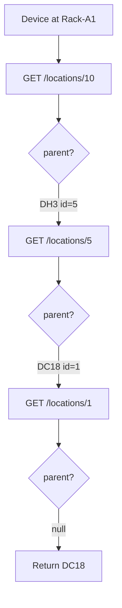

# NetBox Location Hierarchy Resolution (Zabbix sync)

## Purpose

Define how **NetBox DCIM location trees** map to Zabbix **host group / DC_ID** labels and how **location name filters** in device discovery include nested locations.

## Problem (fixed)

Previously, `get_location_name` only looked at the **immediate parent** once. For a chain `DC18 → DH3 → Rack-A1`, a device assigned to `Rack-A1` resolved to **`DH3`** instead of the root **`DC18`**.

The location filter in `fetch_all_devices` only loaded **direct children** of the selected location, so deeper descendants were excluded from the filter set.

## Current behavior

### 1. Root location name (`resolve_root_location_name` / `get_location_name`)

- Start from the device’s assigned `location` (id or expanded object).
- `GET /api/dcim/locations/{id}/` and read `parent`.
- If `parent` is `null`, the current location is the **root**; return its `name`.
- Otherwise follow `parent` (dict with `id` or bare id) and repeat.
- Guards: cycle detection (`visited`), max depth (32), then fallbacks to leaf name or `site.name`.

**Implementation:**

- Ansible: embedded Python in [`playbooks/roles/netbox_zabbix_sync/tasks/process_device.yml`](../../playbooks/roles/netbox_zabbix_sync/tasks/process_device.yml)
- Reference + tests: [`scripts/netbox_location_hierarchy.py`](../../scripts/netbox_location_hierarchy.py)

### 2. Location root map (Loki device fetch)

When devices are fetched from the NetBox API list endpoint, `location.parent` is often missing or shallow. Before normalizing devices, the Loki fetch script loads **all** locations (`GET /api/dcim/locations/`, paginated) and builds `id → root_name` via `build_location_root_map()`. `normalize_device_record()` uses this map so e.g. a device at `TELCO A3` under `DC14` gets `root_location_name` / `DC_ID` = `DC14`.

**Implementation:**

- [`playbooks/roles/netbox_zabbix_sync/files/netbox_device_normalize.py`](../../playbooks/roles/netbox_zabbix_sync/files/netbox_device_normalize.py)
- [`playbooks/roles/netbox_zabbix_sync/tasks/fetch_all_devices_loki.yml`](../../playbooks/roles/netbox_zabbix_sync/tasks/fetch_all_devices_loki.yml)
- Reference: [`scripts/netbox_location_hierarchy.py`](../../scripts/netbox_location_hierarchy.py) (`build_location_root_map`, `fetch_all_locations_paginated`)

### 3. Location filter subtree (BFS + pagination)

When a run uses `location_filter` (by name), the playbook resolves the matching location id, then collects **all descendant** location ids:

- Breadth-first search over `GET /api/dcim/locations/?parent_id={id}&limit=1000`
- Follow `next` until no page remains for each parent.

Device fetch then uses one `location_id` at API level or filters in Python when multiple ids apply (unchanged).

**Implementation:**

- [`playbooks/roles/netbox_zabbix_sync/tasks/fetch_all_devices.yml`](../../playbooks/roles/netbox_zabbix_sync/tasks/fetch_all_devices.yml)
- Same algorithm in [`scripts/netbox_location_hierarchy.py`](../../scripts/netbox_location_hierarchy.py) (`bfs_collect_descendant_location_ids`)

## Diagram

## Related configuration

- [`mappings/host_groups_config.yml`](../../mappings/host_groups_config.yml) — `get_location_name` for computed host groups
- [`mappings/tags_config.yml`](../../mappings/tags_config.yml) — `Location` tag uses root name; `Location_Detail` remains the device’s own location name

## See also

- [HOST_GROUPS_AND_TAGS_IMPLEMENTATION.md](./HOST_GROUPS_AND_TAGS_IMPLEMENTATION.md) (archived single-level note + current summary)
- Platform KB: [`datalake-platform-knowledge-base/adrs/ADR-0005-netbox-location-hierarchy-resolution.md`](../../../../datalake-platform-knowledge-base/adrs/ADR-0005-netbox-location-hierarchy-resolution.md)
