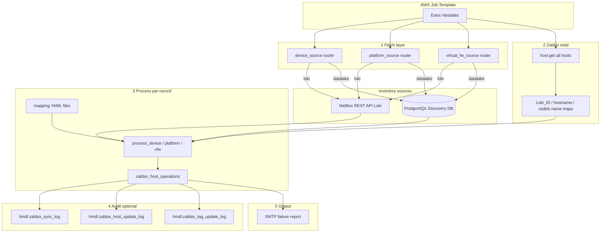
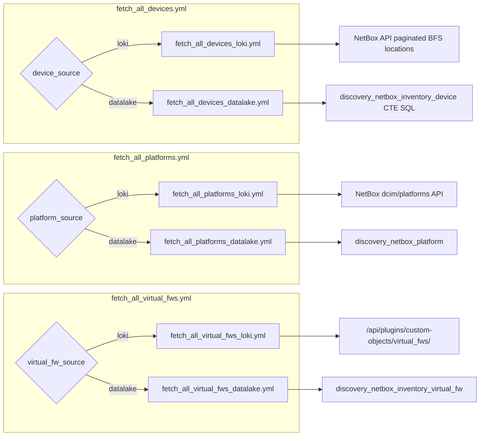
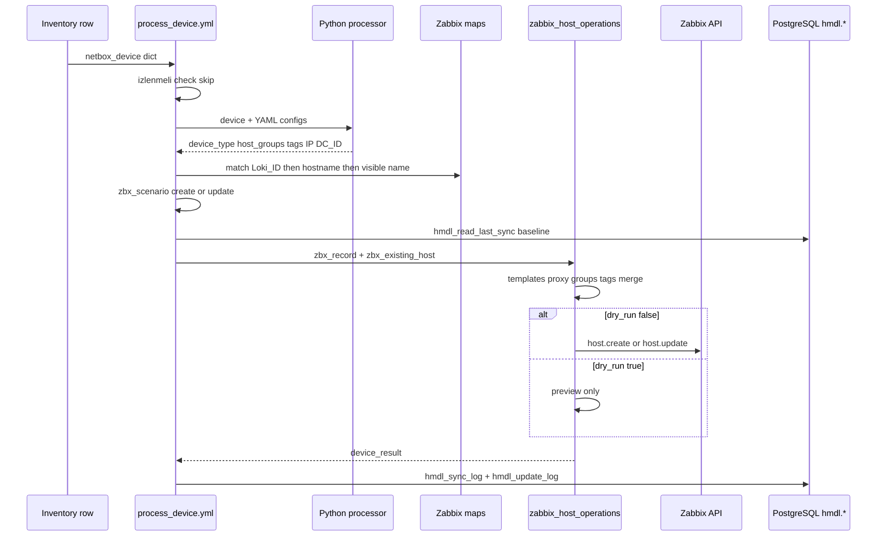
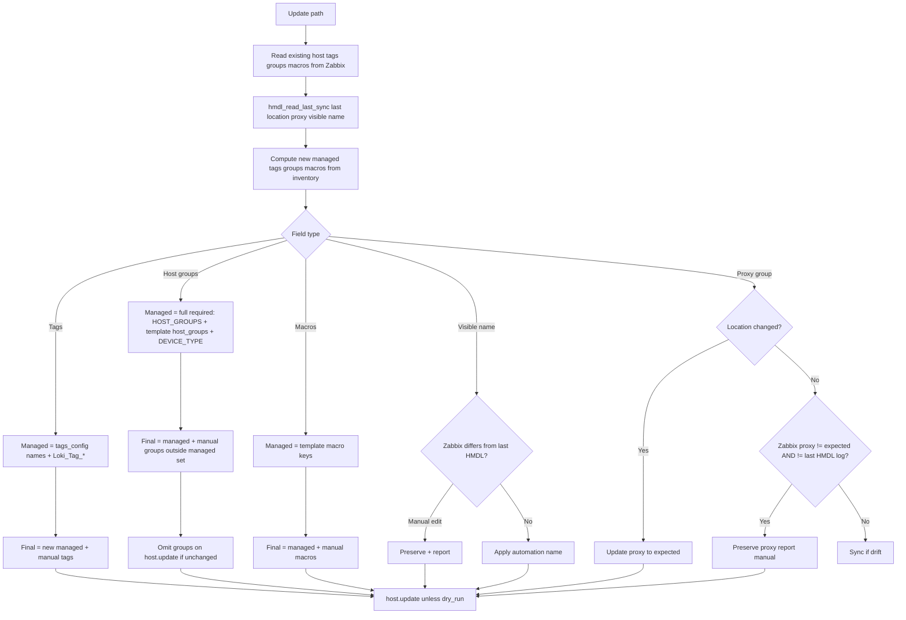
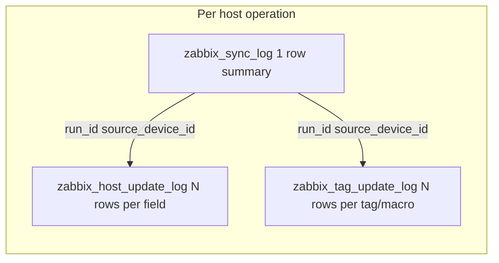

# NetBox / Datalake → Zabbix sync — data flow

End-to-end description of how inventory is fetched, mapped, merged with Zabbix, and audited. Playbook: [`playbooks/netbox_zabbix_sync.yaml`](../../playbooks/netbox_zabbix_sync.yaml), role: `netbox_zabbix_sync`.

## High-level architecture

## Execution phases (role `tasks/main.yml`)

| Phase | Task file | When | Output facts |
|-------|-----------|------|----------------|
| 1 | Load mappings | Always | `templates_map`, `device_type_mapping`, … |
| 2 | `fetch_all_devices.yml` | `sync_devices` or `only_fetch` | `netbox_devices_*` |
| 3 | `fetch_all_virtual_fws.yml` | `sync_virtual_fws` | `netbox_virtual_fws_raw` |
| 4 | `fetch_all_zabbix_hosts.yml` | Not `only_fetch` | `zabbix_hosts_by_loki_id`, `zabbix_hosts_by_hostname`, `zabbix_hosts_by_visible_name` |
| 5 | Filter/limit devices | After fetch | `netbox_devices_final` |
| 6 | `process_device.yml` loop | `sync_devices` | Per-device JSON in `/tmp/zabbix_host_operation_result_*.json` |
| 7 | `process_platform.yml` loop | `sync_platforms` | Platform results |
| 8 | `process_virtual_fw.yml` loop | `sync_virtual_fws` | VFW results |
| 9 | Aggregate + email | End | `processing_results` → SMTP |

Early exit: `only_fetch: true` ends play after fetch summaries (no Zabbix login).

## Inventory source routing

Each host category has its own AWX variable: `device_source`, `platform_source`, `virtual_fw_source` (`loki` | `datalake`).

### Datalake device fetch (SQL)

[`fetch_all_devices_datalake.yml`](../../playbooks/roles/netbox_zabbix_sync/tasks/fetch_all_devices_datalake.yml):

1. `WITH RECURSIVE location_tree` — root location per device (`root_location_name` → `DC_ID`).
2. Join `discovery_loki_location`, `discovery_netbox_platform`, VM cluster maps.
3. Filter `status_value = active` and `izlenmeli` (monitor vs skip queries).
4. Python filter script applies `netbox_device_type_mapping.yml` conditions.

Flat columns used in processing: `device_role_name`, `manufacturer_name`, `device_model`, `sahiplik`, `tags1_name`…`tags5_name`, `root_location_name`, etc.

### Loki device fetch (API)

[`fetch_all_devices_loki.yml`](../../playbooks/roles/netbox_zabbix_sync/tasks/fetch_all_devices_loki.yml):

1. Python script paginates NetBox `dcim/devices/`.
2. BFS collects child locations when `location_filter` is set.
3. Same mapping filter script as datalake path.

Requires: `netbox_url`, `netbox_token`, `netbox_verify_ssl`.

## Per-device processing pipeline

### Mapping YAML (configuration, not inventory)

| File | Role in pipeline |
|------|------------------|
| [`netbox_device_type_mapping.yml`](../../mappings/netbox_device_type_mapping.yml) | Conditions → logical `device_type` |
| [`templates.yml`](../../mappings/templates.yml) | `device_type` → Zabbix templates, macros, `proxy_group_by_dc` |
| [`template_types.yml`](../../mappings/template_types.yml) | Interface type (SNMP/API/…) |
| [`host_groups_config.yml`](../../mappings/host_groups_config.yml) | Sources for host group names |
| [`tags_config.yml`](../../mappings/tags_config.yml) | Managed tag definitions |
| [`datacenters.yml`](../../mappings/datacenters.yml) | Legacy DC helpers (if referenced) |

Processing is **config-driven**: inventory supplies flat fields; YAML defines what becomes Zabbix tags/groups.

## Smart merge on update

When `zbx_scenario == update`, automation does **not** replace the entire Zabbix host blindly.

Reference implementation: [`module_utils/zabbix_merge_helpers.py`](../../playbooks/roles/netbox_zabbix_sync/module_utils/zabbix_merge_helpers.py).

## Host matching (idempotency)

Order used to find existing Zabbix host before create:

1. **Loki_ID** tag → `zabbix_hosts_by_loki_id`
2. **Technical hostname** → `zabbix_hosts_by_hostname`
3. **Visible name** → `zabbix_hosts_by_visible_name`
4. On create duplicate error → same chain in `zabbix_host_operations.yml`

Create path uses technical hostname filter `zabbix_technical_hostname` for ASCII-safe Zabbix `host` field.

## HMDL audit trail

| Table | Written when | Key columns |
|-------|--------------|-------------|
| `hmdl.zabbix_sync_log` | Every processed/skipped host | `status`, `inventory_source`, `proxy_manual_change_detected`, `field_merge_actions` |
| `hmdl.zabbix_host_update_log` | Update with field changes | `field_name`, `merge_result` |
| `hmdl.zabbix_tag_update_log` | Update with tag/macro changes | `object_type`, `key_name`, `action` |

DDL: [`SQL/zabbix-netbox/`](../../../SQL/zabbix-netbox/).

Baseline read for next run: [`hmdl_read_last_sync.yml`](../../playbooks/roles/netbox_zabbix_sync/tasks/hmdl_read_last_sync.yml) — last successful row per `source_device_id`.

## Related documents

- [AWX Kullanım Rehberi](../guides/AWX_KULLANIM_REHBERI.md) — all Extra Variables
- [Host groups and tags](HOST_GROUPS_AND_TAGS_IMPLEMENTATION.md)
- [Location hierarchy](LOCATION_HIERARCHY_RESOLUTION.md)
- [SQL used in datalake fetch](../KULLANILAN_SQLLER.md)
