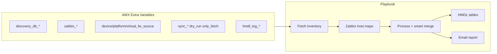

# AWX Kullanım Rehberi — NetBox / Datalake → Zabbix Sync

Bu rehber, **`netbox_zabbix_sync`** rolünü Ansible AWX / AAP üzerinde çalıştırmak için girilen **Extra Variables** (ve önerilen **Survey**) alanlarını, koşullu zorunlulukları ve test senaryolarını açıklar.

| Konu | Doküman |
|------|---------|
| Veri akışı, smart merge, HMDL | [SYNC_DATA_FLOW.md](../design/SYNC_DATA_FLOW.md) |
| İngilizce özet | [AWX_GUIDE.md](AWX_GUIDE.md) |
| SQL şema / migration | [`SQL/zabbix-netbox/`](../../../SQL/zabbix-netbox/README.md) |
| Playbook | [`playbooks/netbox_zabbix_sync.yaml`](../../playbooks/netbox_zabbix_sync.yaml) |
| Varsayılanlar | [`defaults/main.yml`](../../playbooks/roles/netbox_zabbix_sync/defaults/main.yml) |

---

## 1. AWX Job Template ayarları

| Alan | Önerilen değer |
|------|----------------|
| **Inventory** | `localhost` (playbook `hosts: localhost` ile çalışır) |
| **Project SCM** | `project-zabake` → `zabbix-netbox/` kökü veya playbook yolu buna göre |
| **Playbook** | `playbooks/netbox_zabbix_sync.yaml` |
| **Credentials** | AWX Credential Type veya Vault: DB şifresi, Zabbix şifresi, (Loki kullanılıyorsa) NetBox token |
| **Verbosity** | `1` (normal), sorun giderme için `2` |
| **Limit** | Boş (tüm localhost) |

Ortam değişkenleri AWX tarafından otomatik gelir:

- `AWX_JOB_ID` → HMDL `run_id` / job izleme
- `JOB_TEMPLATE_NAME` (varsa) → log metadata

---

## 2. Mimari özet (job input → sonuç)



Detaylı fazlar ve diyagramlar: **[SYNC_DATA_FLOW.md](../design/SYNC_DATA_FLOW.md)**.

---

## 3. Değişken referansı (tam liste)

### 3.1 Zorunlu — Discovery PostgreSQL

Playbook `pre_tasks` içinde **her zaman** doğrulanır (`datalake` kaynağı ve HMDL için gerekli).

| Değişken | Tip | Varsayılan | Açıklama |
|----------|-----|------------|----------|
| `discovery_db_host` | string | `""` | PostgreSQL host |
| `discovery_db_port` | int | `5000` | Port (ortamınıza göre `5432` olabilir) |
| `discovery_db_name` | string | `""` | Veritabanı adı (örn. `bulutlake`) |
| `discovery_db_user` | string | `""` | Kullanıcı |
| `discovery_db_password` | string | `""` | Şifre (Vault önerilir) |

```yaml
discovery_db_host: "postgresql.example.com"
discovery_db_port: 5432
discovery_db_name: "bulutlake"
discovery_db_user: "zabbix_sync_ro"
discovery_db_password: "{{ vault_discovery_db_password }}"
```

**Kullanım:** `device_source`, `platform_source` veya `virtual_fw_source` = `datalake` iken envanter bu DB’den okunur. Ayrıca HMDL log varsayılan olarak aynı bağlantıyı kullanır.

---

### 3.2 Zorunlu — Zabbix API

Playbook **her zaman** doğrular (`only_fetch: true` olsa bile — job şablonunda tanımlı olmalı; fetch-only modda API çağrılmaz).

| Değişken | Tip | Varsayılan | Açıklama |
|----------|-----|------------|----------|
| `zabbix_url` | string | `""` | JSON-RPC URL, örn. `https://zabbix.example.com/api_jsonrpc.php` |
| `zabbix_user` | string | `""` | API kullanıcısı |
| `zabbix_password` | string | `""` | API şifresi |
| `zabbix_validate_certs` | bool | `false` | TLS sertifika doğrulama |
| `zabbix_api_timeout` | int | `300` | Zabbix JSON-RPC `uri` çağrıları için timeout (saniye); varsayılan 5 dakika |

---

### 3.3 Koşullu zorunlu — NetBox (Loki) API

Aşağıdakilerden **herhangi biri** `loki` ise `netbox_url` ve `netbox_token` dolu olmalıdır; aksi halde fetch task’ları hata verir.

| Değişken | Tip | Varsayılan | Açıklama |
|----------|-----|------------|----------|
| `netbox_url` | string | `""` | NetBox kök URL, örn. `https://loki.bulutistan.com` |
| `netbox_token` | string | `""` | API token |
| `netbox_verify_ssl` | bool | `false` | TLS doğrulama |

**Örnek — sadece cihazlar datalake, platform/VFW Loki:**

```yaml
device_source: datalake
platform_source: loki
virtual_fw_source: loki
netbox_url: "https://loki.example.com"
netbox_token: "{{ vault_netbox_token }}"
```

---

### 3.4 Envanter kaynağı (host tipi bazında)

Her kategori bağımsız seçilir: **`loki`** (NetBox REST) veya **`datalake`** (PostgreSQL discovery tabloları).

| Değişken | İzin verilen | Varsayılan | Fetch task |
|----------|--------------|------------|------------|
| `device_source` | `loki`, `datalake` | `datalake` | `fetch_all_devices_loki.yml` / `fetch_all_devices_datalake.yml` |
| `platform_source` | `loki`, `datalake` | `loki` | `fetch_all_platforms_loki.yml` / `fetch_all_platforms_datalake.yml` |
| `virtual_fw_source` | `loki`, `datalake` | `loki` | `fetch_all_virtual_fws_loki.yml` / `fetch_all_virtual_fws_datalake.yml` |

| Kaynak | Cihazlar | Platformlar | Sanal FW |
|--------|----------|-------------|----------|
| **datalake** | `discovery_netbox_inventory_device` (+ location CTE) | `discovery_netbox_platform` | `discovery_netbox_inventory_virtual_fw` |
| **loki** | `GET /api/dcim/devices/` (+ BFS location) | `GET /api/dcim/platforms/` | `GET /api/plugins/custom-objects/virtual_fws/` |

Log kolonu `inventory_source` bu değeri yansıtır (`device` işlemlerinde `device_source`).

#### Loki vs datalake — cihaz şeması (`device_source`)

`process_device` ve HMDL çıktısı **datalake düz kolonlarını** bekler: `device_role_name`, `manufacturer_name`, `device_model`, `primary_ip_address`, `location_name`, `root_location_name`, `site_name`, `tenant_name`.

| Kaynak | Fetch çıktısı | Process uyumu |
|--------|---------------|---------------|
| **datalake** | SQL satırları zaten düz kolonlu | Doğrudan uyumlu |
| **loki** | NetBox REST iç içe JSON (`role`, `device_type`, `primary_ip4`, …) | Fetch sonrası `netbox_device_normalize.py` ile düz alanlara çevrilir; process tarafında da aynı modül ile yedek (nested) okuma vardır |

`device_source: loki` kullanırken eski sürümlerde görülen **`Device type bulunamadı`** hatası genelde NetBox’ta role eksikliği değil, process’in boş `device_role_name` görmesinden kaynaklanırdı. Güncel rol: Loki fetch eşleşen her cihazı normalize ederek `netbox_devices_final` listesine yazar.

Geçici workaround (kod güncellenemiyorsa): discovery DB güncelse `device_source: datalake`.

---

### 3.5 Senkron kapsamı ve çalışma modu

| Değişken | Tip | Varsayılan | Açıklama |
|----------|-----|------------|----------|
| `sync_devices` | bool | `true` | Fiziksel/sanal cihaz senkronu |
| `sync_platforms` | bool | `false` | Platform host senkronu |
| `sync_virtual_fws` | bool | `false` | Sanal firewall senkronu |
| `only_fetch` | bool | `false` | `true`: yalnızca envanter çekilir; Zabbix login, işleme ve e-posta **yok** |
| `dry_run` | bool | `false` | `true`: tüm eşleme ve validasyon çalışır; **`host.create` / `host.update` çağrılmaz** |
| `report_izlenmeyecek` | bool | `true` | `izlenmeli=Hayır` kayıtları rapora dahil |

En az biri açık olmalı: `sync_devices`, `sync_platforms`, `sync_virtual_fws` veya `only_fetch: true`.

**`dry_run` vs `only_fetch`:**

| Mod | Envanter | Zabbix okuma | Zabbix yazma | HMDL (açıksa) |
|-----|----------|--------------|--------------|---------------|
| Normal | Evet | Evet | Evet | Evet |
| `dry_run: true` | Evet | Evet | Hayır | Evet (`status=dry_run`) |
| `only_fetch: true` | Evet | Hayır | Hayır | Hayır (işleme yok) |

---

### 3.6 Filtreleme ve limit

| Değişken | Tip | Varsayılan | Açıklama |
|----------|-----|------------|----------|
| `device_limit` | int | `0` | `0` = limitsiz; test için örn. `10` (sadece device işleme) |
| `location_filter` | string | `""` | Lokasyon adı; Loki’de BFS ile alt lokasyonlar dahil; datalake SQL filtresi |

Cihaz tipi seçimi **`netbox_device_type_mapping.yml`** koşullarına göre yapılır (AWX’te ayrı parametre yok).

---

### 3.7 Yeni host oluşturma davranışı

| Değişken | Varsayılan | Açıklama |
|----------|------------|----------|
| `create_devices_disabled` | `false` | Yeni device host’ları Zabbix’te **disabled** oluştur |
| `create_platforms_disabled` | `false` | Yeni platform host’ları disabled |
| `create_virtual_fws_disabled` | `false` | Yeni VFW host’ları disabled |

---

### 3.8 HMDL audit log

| Değişken | Varsayılan | Açıklama |
|----------|------------|----------|
| `hmdl_log_enabled` | `false` | `true` → `hmdl.zabbix_sync_log` (+ update/tag log) |
| `hmdl_log_schema` | `hmdl` | PostgreSQL şema |
| `hmdl_log_table` | `zabbix_sync_log` | Ana özet tablo |
| `hmdl_playbook_name` | `db_to_zabbix_sync` | Metadata |
| `hmdl_db_host` | `{{ discovery_db_host }}` | Log DB (farklıysa override) |
| `hmdl_db_port` | `{{ discovery_db_port }}` | |
| `hmdl_db_name` | `{{ discovery_db_name }}` | |
| `hmdl_db_user` | `{{ discovery_db_user }}` | |
| `hmdl_db_password` | `{{ discovery_db_password }}` | |

**Önerilen üretim:**

```yaml
hmdl_log_enabled: true
```

Tablo DDL ve migration: [`SQL/zabbix-netbox/`](../../../SQL/zabbix-netbox/README.md).

**Smart merge ile ilgili kolonlar:** `proxy_manual_change_detected`, `field_merge_actions`, `last_managed_groups`, `inventory_source`, `host_entity_type`.

---

### 3.9 E-posta bildirimi

| Değişken | Varsayılan | Açıklama |
|----------|------------|----------|
| `mail_recipients` | `[]` | Alıcı listesi; boşsa e-posta gönderilmez |
| `mail_from` | `infrareport@alert.bulutistan.com` | Gönderen |
| `mail_smtp_host` | `10.34.8.191` | SMTP |
| `mail_smtp_port` | `587` | |
| `mail_smtp_username` | `""` | |
| `mail_smtp_password` | `""` | |
| `mail_smtp_use_tls` | `false` | |

---

### 3.10 Mapping dosya yolları (genelde override gerekmez)

| Değişken | Dosya |
|----------|-------|
| `templates_map_path` | `mappings/templates.yml` |
| `device_type_mapping_path` | `mappings/netbox_device_type_mapping.yml` |
| `platform_mapping_path` | `mappings/netbox_platform_mapping.yml` |
| `virtual_fw_mapping_path` | `mappings/virtual_fw_mapping.yml` |
| `host_groups_config_path` | `mappings/host_groups_config.yml` |
| `tags_config_path` | `mappings/tags_config.yml` |
| `datacenters_map_path` | `mappings/datacenters.yml` |

---

## 4. Örnek Extra Variables blokları

### 4.1 Üretim — cihazlar datalake, platform/VFW kapalı

```yaml
# --- DB (zorunlu) ---
discovery_db_host: "10.x.x.x"
discovery_db_port: 5432
discovery_db_name: "bulutlake"
discovery_db_user: "zabbix_sync"
discovery_db_password: "{{ vault_discovery_password }}"

# --- Zabbix (zorunlu) ---
zabbix_url: "https://zabbix.example.com/api_jsonrpc.php"
zabbix_user: "api_sync"
zabbix_password: "{{ vault_zabbix_password }}"
zabbix_validate_certs: false

# --- Kaynaklar ---
device_source: datalake
platform_source: loki
virtual_fw_source: loki
netbox_url: "https://loki.example.com"
netbox_token: "{{ vault_netbox_token }}"
netbox_verify_ssl: false

# --- Kapsam ---
sync_devices: true
sync_platforms: false
sync_virtual_fws: false
dry_run: false
only_fetch: false
device_limit: 0
location_filter: ""

# --- Audit & mail ---
hmdl_log_enabled: true
mail_recipients:
  - "noc@example.com"
```

### 4.2 İlk test — dry-run, 10 cihaz

```yaml
dry_run: true
hmdl_log_enabled: true
sync_devices: true
sync_platforms: false
device_limit: 10
device_source: datalake
# ... discovery_db_* ve zabbix_* aynı şekilde
```

### 4.3 Sadece envanter kontrolü

```yaml
only_fetch: true
sync_devices: true
device_source: datalake
# discovery_db_* zorunlu; zabbix_* playbook validasyonu için yine job'da olmalı
```

### 4.4 Tam Loki (NetBox API) — legacy / karşılaştırma

```yaml
device_source: loki
platform_source: loki
virtual_fw_source: loki
netbox_url: "https://loki.example.com"
netbox_token: "{{ vault_netbox_token }}"
sync_devices: true
```

### 4.5 Sanal firewall senkronu

```yaml
sync_virtual_fws: true
virtual_fw_source: loki   # veya datalake
create_virtual_fws_disabled: true   # ilk turda önerilir
```

---

## 5. AWX Survey önerisi

Survey, operatörün her seferinde YAML yazmadan güvenli seçim yapmasını sağlar. **Sensitive** alanlar için AWX **Credential** veya Survey **encrypted** kullanın.

| Soru (label) | Variable | Tip | Varsayılan | Not |
|--------------|----------|-----|------------|-----|
| Device inventory source | `device_source` | multiple choice | `datalake` | `loki`, `datalake` |
| Platform inventory source | `platform_source` | multiple choice | `loki` | |
| Virtual FW inventory source | `virtual_fw_source` | multiple choice | `loki` | |
| Sync devices | `sync_devices` | boolean | true | |
| Sync platforms | `sync_platforms` | boolean | false | |
| Sync virtual firewalls | `sync_virtual_fws` | boolean | false | |
| Dry run (no Zabbix writes) | `dry_run` | boolean | false | |
| Only fetch inventory | `only_fetch` | boolean | false | |
| Device limit (0=all) | `device_limit` | integer | 0 | min 0 |
| Location filter | `location_filter` | text | | boş = tümü |
| Enable HMDL audit log | `hmdl_log_enabled` | boolean | true | |
| Create new devices disabled | `create_devices_disabled` | boolean | false | |

DB / Zabbix / NetBox kimlik bilgileri Survey yerine **Job Template → Credentials** veya sabit Vault referanslı Extra Vars ile verilmelidir.

---

## 6. Smart merge ve proxy (operatör notları)

Güncelleme (`update`) sırasında:

| Alan | Davranış |
|------|----------|
| **Tags** | `tags_config` + `Loki_Tag_*` yönetilen; diğer tag’ler korunur |
| **Host groups** | Config’ten gelen yönetilen gruplar güncellenir; manuel gruplar korunur |
| **Macros** | Template makroları yönetilen; manuel makrolar korunur |
| **Visible name** | Son HMDL kaydına göre manuel değişiklik şüphesi → korunur, raporlanır |
| **Proxy group** | **Lokasyon değiştiyse** → beklenen proxy uygulanır. Lokasyon aynı, Zabbix proxy ≠ beklenen ve son log da eşleşmiyorsa → **güncellenmez**, `proxy_manual_change_detected: true` |

Proxy manuel değişiklik sorgusu:

```sql
SELECT processed_at, source_device_name, zabbix_hostname,
       proxy_group_id, proxy_group_name, proxy_manual_change_detected,
       field_merge_actions
FROM hmdl.zabbix_sync_log
WHERE proxy_manual_change_detected = TRUE
  AND processed_at >= NOW() - INTERVAL '7 days'
ORDER BY processed_at DESC;
```

Akış diyagramı: [SYNC_DATA_FLOW.md — Smart merge](../design/SYNC_DATA_FLOW.md#smart-merge-on-update).

---

## 7. Çalıştırma senaryoları (sıralı test planı)

| Adım | Amaç | Önemli değişkenler |
|------|------|-------------------|
| 1 | Önizleme, yazma yok | `dry_run: true`, `device_limit: 10`, `hmdl_log_enabled: true` |
| 2 | SQL/API envanter doğrulama | `only_fetch: true`, `sync_devices: true` |
| 3 | Sınırlı gerçek sync | `dry_run: false`, `device_limit: 20`, `location_filter: "ICT11"` |
| 4 | Tam sync | `device_limit: 0`, `location_filter: ""` |

---

## 8. HMDL sorguları

### Son job özeti

```sql
SELECT status, operation, COUNT(*) AS adet
FROM hmdl.zabbix_sync_log
WHERE run_id = '{{ awx_job_id }}'   -- veya AWX çıktısındaki run_id
GROUP BY status, operation
ORDER BY adet DESC;
```

### Başarısız kayıtlar (24 saat)

```sql
SELECT processed_at, source_device_name, zabbix_hostname,
       device_type, status, reason, inventory_source
FROM hmdl.zabbix_sync_log
WHERE processed_at >= NOW() - INTERVAL '24 hours'
  AND status = 'eklenemedi'
ORDER BY processed_at DESC;
```

### Dry-run

```sql
SELECT source_device_name, zabbix_hostname, operation, reason, field_merge_actions
FROM hmdl.zabbix_sync_log
WHERE status = 'dry_run'
ORDER BY processed_at DESC
LIMIT 50;
```

### Cihaz bazlı son durum

```sql
SELECT DISTINCT ON (source_device_id)
    source_device_id, source_device_name, zabbix_hostname,
    status, inventory_source, proxy_manual_change_detected, processed_at
FROM hmdl.zabbix_sync_log
ORDER BY source_device_id, processed_at DESC;
```

---

## 9. Status değerleri

| Status | Anlamı |
|--------|--------|
| `eklendi` | Yeni host oluşturuldu |
| `güncellendi` | Mevcut host güncellendi |
| `güncel` | Değişiklik gerekmedi |
| `eklenemedi` | Hata / validasyon |
| `atlandı` | `izlenmeli=Hayır` vb. |
| `dry_run` | `dry_run: true`; API yazımı yok |

---

## 10. Sık sorunlar

| Belirti | Olası neden | Çözüm |
|---------|-------------|--------|
| `discovery_db_host is required` | Extra var eksik | DB blokunu job template’e ekle |
| NetBox 401 / boş liste | `loki` seçili, token yok | `netbox_url` + `netbox_token` |
| `device_source must be 'loki' or 'datalake'` | Yanlış yazım | Küçük harf, tam eşleşme |
| Proxy güncellenmiyor | Manuel değişiklik algılandı | `proxy_manual_change_detected` loguna bak |
| Log yazılmıyor | `hmdl_log_enabled: false` | `true` yap; şema migration çalıştır |
| Zabbix duplicate | Eşleşme zinciri | Loki_ID → hostname → visible name; bkz. SYNC_DATA_FLOW |
| CSV `Application error.` | Phase B yalnızca `error.message` logluyordu | `error.data` artık `reason` + CSV `Error Detail`; geçmiş run için `hmdl.zabbix_sync_log.error_payload` |
| Loki cihazı + Zabbix discovery host eşleşmesi | `host.flags & 4` | `atlandı` / `Network Discovery, no action taken` — Zabbix API çağrısı yok; bkz. [[NetBox-Loki]] |

---

## 11. İlgili dokümanlar

- [SYNC_DATA_FLOW.md](../design/SYNC_DATA_FLOW.md) — fetch, process, merge, HMDL
- [HOST_GROUPS_AND_TAGS_IMPLEMENTATION.md](../design/HOST_GROUPS_AND_TAGS_IMPLEMENTATION.md)
- [LOCATION_HIERARCHY_RESOLUTION.md](../design/LOCATION_HIERARCHY_RESOLUTION.md)
- [AWX_GUIDE.md](AWX_GUIDE.md) — English summary
