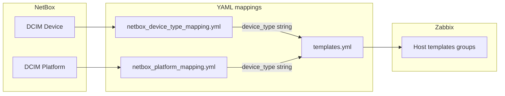

# NetBox → Zabbix mapping files (index)

This page ties together the three primary YAML files that drive **logical `device_type`** resolution and **Zabbix template assignment** for the `netbox_zabbix_sync` role. Authoritative deep dives live in the linked guides; avoid duplicating long procedures here.

## Data flow

## When to edit which file

| File | Purpose | Typical changes |
|------|---------|-----------------|
| [`mappings/netbox_device_type_mapping.yml`](../../mappings/netbox_device_type_mapping.yml) | Map NetBox **device** records to a logical `device_type` string | New manufacturer / model / role rules; optional `tenant` / `tenants` for customer-specific types; `hostname_prefix` / `hostname_suffix`; `priority` ordering |
| [`mappings/netbox_platform_mapping.yml`](../../mappings/netbox_platform_mapping.yml) | Map NetBox **`platform.manufacturer.name`** to `device_type` and optional **per-DC limits** | New virtualization / backup platform rows; `limit_per_dc` (`0` or omitted = no limit) |
| [`mappings/templates.yml`](../../mappings/templates.yml) | Map `device_type` → list of Zabbix templates, interface `type`, macros, extra host groups | Multiple templates per type; `macros` with `{HOST.IP}` / `{HOST.NAME}`; `host_groups`; `proxy_group_by_dc` |

**Invariant:** Every `device_type` produced by **either** `netbox_device_type_mapping.yml` **or** `netbox_platform_mapping.yml` must exist as a **top-level key** in `templates.yml` with **identical spelling** (keys are case-sensitive). The platform section in `templates.yml` is preceded by an in-file comment marking keys required for platform sync.

## Rule summaries

### `netbox_device_type_mapping.yml`

- **Evaluation order:** Entries are sorted by `priority` (**lower number = evaluated first**). After optional tenant filtering, the **first** row whose `conditions` all match wins.
- **Tenant scope:** Optional root-level `tenant` or `tenants`. If `tenants` is present, only that list is used (same-row `tenant` is ignored). Devices without a matching NetBox tenant skip tenant-scoped rows. [`fetch_all_devices.yml`](../../playbooks/roles/netbox_zabbix_sync/tasks/fetch_all_devices.yml) applies the same tenant gate as [`process_device.yml`](../../playbooks/roles/netbox_zabbix_sync/tasks/process_device.yml).
- **`conditions`:** Combined with **AND**. Supported keys only (anything else never matches — keep in sync with playbook Python and [`tests/test_device_type_mapping.py`](../../tests/test_device_type_mapping.py)):
  - `device_role` — `role.name` / `device_role` (string or list, case-insensitive)
  - `manufacturer` — `device_type.manufacturer.name` (string or list)
  - `model_contains` — substring in model (list: any match)
  - `model_suffix` — model ends with value
  - `name_contains` — substring in device `name`
- **Zabbix visible name:** `hostname_prefix` + normalized NetBox device name + `hostname_suffix` (no automatic separator; include spaces or hyphens in the fields if you want them).

### `netbox_platform_mapping.yml`

- **Match:** `manufacturer` is matched against NetBox platform manufacturer with a **case-insensitive full-string** regex (`(?i)^...$`) in [`process_platform.yml`](../../playbooks/roles/netbox_zabbix_sync/tasks/process_platform.yml).
- **Fields:** `manufacturer` (required), `device_type` (required; must match a `templates.yml` key), `limit_per_dc` (optional). DC code extraction for limits follows the comment at the top of the YAML file (first `(DC|AZ|ICT|UZ)[0-9]+` match from the Site/DC label).

### `templates.yml`

- **Structure:** Top-level key = `device_type`; value = YAML **list** of template objects. Each object needs at least `name` (exact Zabbix template name) and `type` (must exist in [`template_types.yml`](../../mappings/template_types.yml)).
- **Secrets:** Do not commit production passwords or tokens. Prefer AWX credentials, Ansible Vault, or templated extra vars; see [Template macros guide](../guides/TEMPLATE_MACROS_GUIDE.md).

## Ansible path variables

Override these in playbook extra vars if files live outside the default layout ([`defaults/main.yml`](../../playbooks/roles/netbox_zabbix_sync/defaults/main.yml)):

| Variable | Default (relative to playbook dir) |
|----------|----------------------------------|
| `templates_map_path` | `../mappings/templates.yml` |
| `device_type_mapping_path` | `../mappings/netbox_device_type_mapping.yml` |
| `platform_mapping_path` | `../mappings/netbox_platform_mapping.yml` |

## Detailed documentation (read next)

| Topic | Document |
|-------|----------|
| Device-type conditions, tenant rules, hostname fields | [README_NETBOX_DEVICE_TYPE_MAPPING.md](README_NETBOX_DEVICE_TYPE_MAPPING.md) |
| Platform sync, `limit_per_dc`, adding a platform type | [PLATFORM_SYNC_GUIDE.md](../guides/PLATFORM_SYNC_GUIDE.md) |
| Host groups / tags derived from mappings | [README_CONFIG.md](../../mappings/README_CONFIG.md) |
| Multiple Zabbix templates per `device_type`, linked-template caveats | [MULTIPLE_TEMPLATES_GUIDE.md](../guides/MULTIPLE_TEMPLATES_GUIDE.md) |
| `macros`, `{HOST.IP}`, API-style templates | [TEMPLATE_MACROS_GUIDE.md](../guides/TEMPLATE_MACROS_GUIDE.md) |

## Related tests

- Device mapping logic: [`tests/test_device_type_mapping.py`](../../tests/test_device_type_mapping.py)
- Platform mapping YAML shape: [`tests/test_platforms_feature.py`](../../tests/test_platforms_feature.py)
- `templates.yml` syntax / types: [`tests/test_templates_yaml_syntax.py`](../../tests/test_templates_yaml_syntax.py), [`tests/validate_yaml_syntax.py`](../../tests/validate_yaml_syntax.py)
